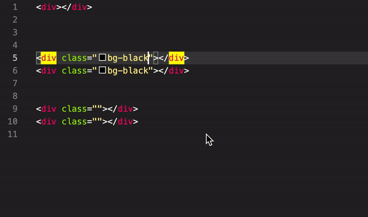

# vscode-class-nav

## Features

* jump into class quotes last position
* jump into upper line class quotes
* jump into lover line class quotes


Basic plugin for HTML class navigation

## Commands

* `class-navigation.jumpUpToClass` : jump into upper line class quotes
* `class-navigation.jumpDownToClass` : jump into lover line class quotes
* `class-navigation.jumpIntoClass`:  jump into class quotes last position

```json
    {
        "key": "ctrl+alt+right",
        "command": "class-navigation.jumpIntoClass"
    },
    {
        "key": "ctrl+alt+up",
        "command": "class-navigation.jumpUpToClass"
    },
    {
        "key": "ctrl+alt+down",
        "command": "class-navigation.jumpDownToClass"
    },
```




